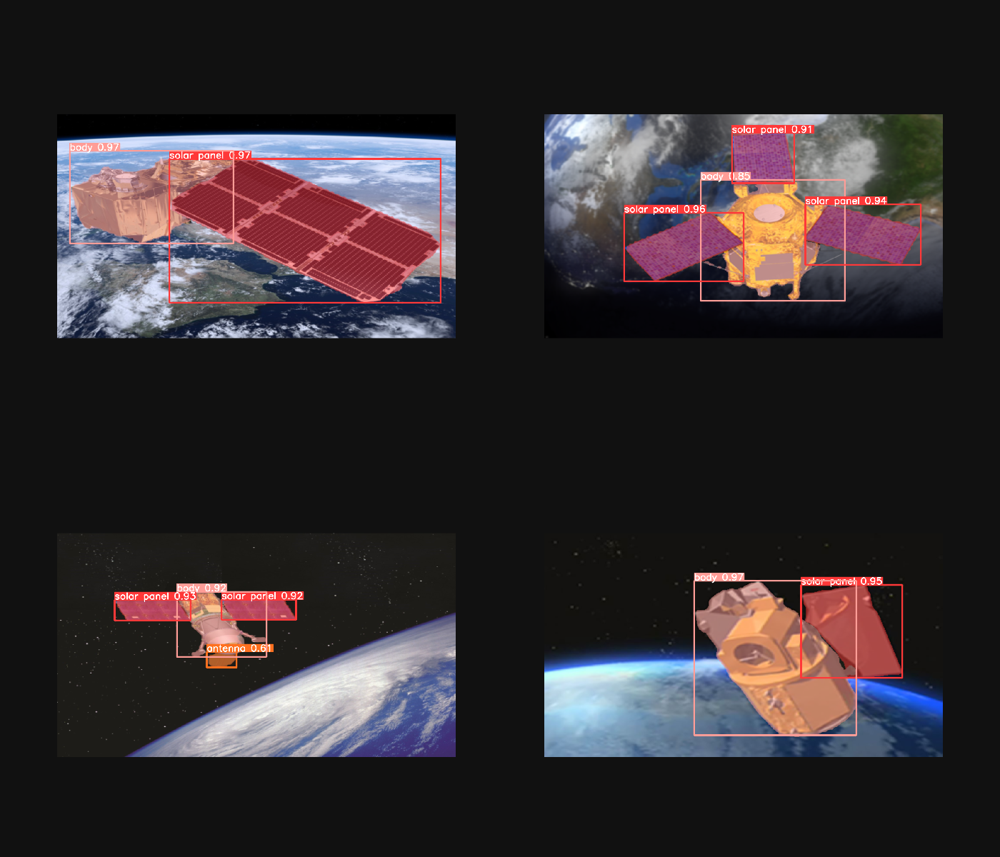

# 
Сегментация космических аппаратов
</img>

Датасет был взят из [<b>репозитория</b>](https://github.com/Yurushia1998/SatelliteDataset)

В качестве модели для файн-тюнинга использовалась [<b><i>YOLOv8x-seg</b></i>](https://docs.ultralytics.com/tasks/segment/)

Обучение производилось на 50-ти эпохах, в результате были получены следующие метрики:
* $\text{mIoU} \approx 0.9$
* $F_1 \text{-score} \approx 0.64$
* $\text{mAP}@0.5 \approx 0.59$

Пример предсказаний обученной модели:

</img>